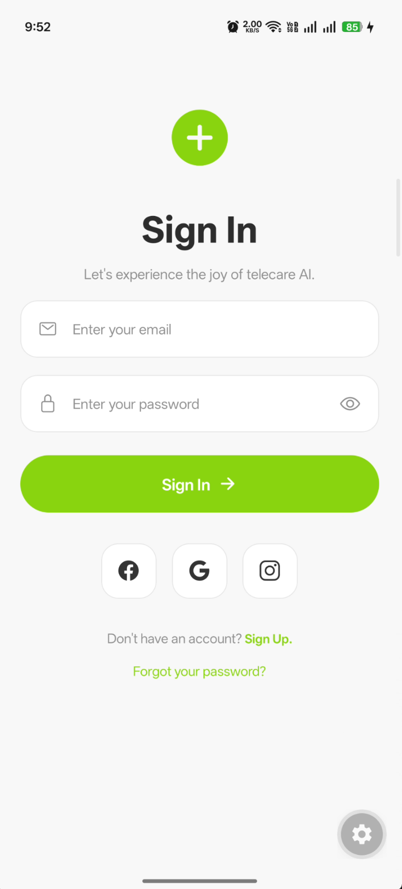

# 📱 Telecare Auth UI

A modern and responsive authentication interface built with **React Native**, **Expo**, and **TypeScript**.

This project recreates a Telecare-inspired mobile authentication screen with a strong focus on clean UI implementation, reusable components, responsive layouts, and modern mobile development practices.

---

## ✨ Preview

### Sign In Screen



---

## 🚀 Features

* Modern authentication UI
* Responsive mobile-first design
* Email and password inputs
* Password visibility toggle
* Social authentication buttons
* Sign Up and Forgot Password actions
* Reusable UI components
* TypeScript support
* Expo Router integration
* Clean project architecture

---

## 🛠️ Tech Stack

* React Native
* Expo
* TypeScript
* Expo Router
* Expo Vector Icons

---

## 📂 Project Structure

```text
src
├── components
│   ├── CustomInput.tsx
│   └── SocialButton.tsx
│
├── constants
│   └── colors.ts
│
└── screens
    └── SignInScreen.tsx
```

---

## ⚙️ Getting Started

### Clone the repository

```bash
git clone https://github.com/Ashishjha013/telecare-signin-ui.git
```

### Navigate to the project

```bash
cd telecare-signin-ui
```

### Install dependencies

```bash
pnpm install
```

### Start the development server

```bash
pnpm start
```

### Run on Android

```bash
pnpm run android
```

### Run on Web

```bash
pnpm run web
```

---

## 🎯 Learning Outcomes

This project helped strengthen understanding of:

* React Native fundamentals
* Component-based architecture
* Flexbox layouts
* Mobile UI development
* TypeScript props and typing
* Responsive design principles
* Expo development workflow
* Reusable component patterns

---

## 🎨 Design Inspiration

Inspired by a Telecare authentication UI concept from Dribbble.

---

## ✨ Author
**Ashish Kumar Jha**
📍 India • Backend Developer

---

## 📬 Contact
- GitHub: https://github.com/Ashishjha013
- LinkedIn: https://www.linkedin.com/in/ashishjha13
- Email: ashishjha1304@gmail.com
